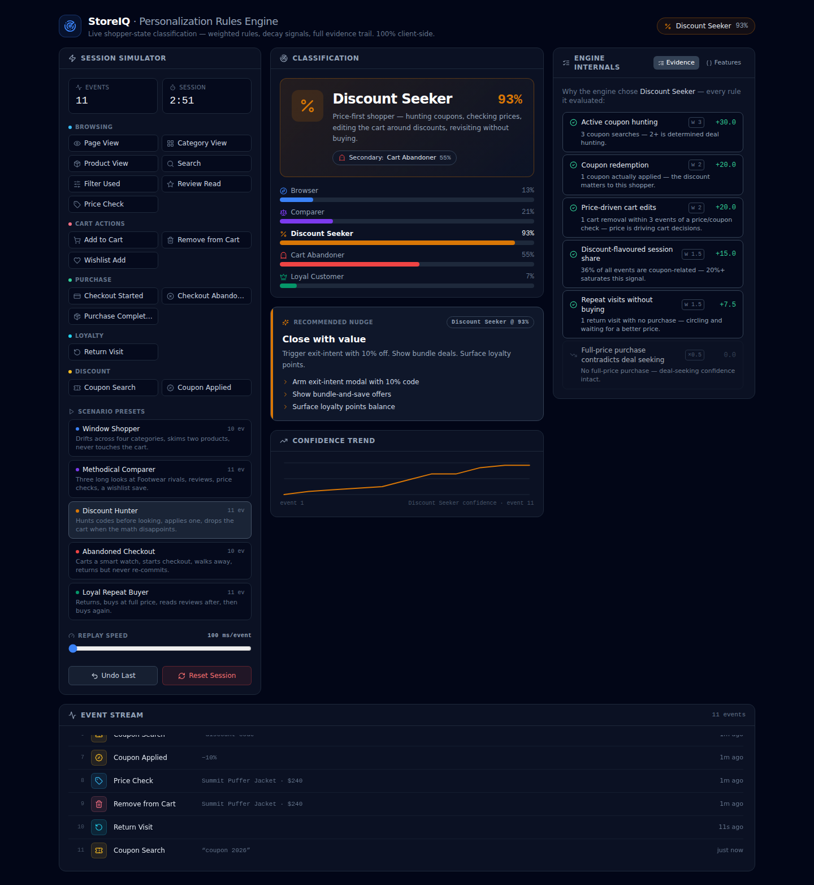

# StoreIQ — Ecommerce Personalization Rules Engine

A production-grade, fully client-side rules engine that classifies a live shopper
session into one of five behavioural states and recommends the next-best
personalization action. Shipped as a **single self-contained React artifact**:
[`PersonalizationRulesEngine.jsx`](./PersonalizationRulesEngine.jsx).

## What it does

Feed the engine a stream of shopper events (page views, cart edits, coupon
searches, checkouts…) and it returns a ranked classification across five
shopper states — with the complete evidence trail that produced it:

| State | Accent | Defining signals | Sharpest decay |
|---|---|---|---|
| **Browser** | blue | browsing-dominant event mix, category breadth, shallow dwell, broad searches | add-to-cart ×0.6, checkout ×0.5 |
| **Comparer** | purple | 3+ product views in one category, filters, reviews, price checks, long dwell | quick decisive purchase ×0.55 |
| **Discount Seeker** | amber | coupon hunting/redemption, price-driven cart edits, revisits without buying | full-price purchase ×0.5 |
| **Cart Abandoner** | red | abandoned checkout, cart churn, idle after cart activity, return w/o re-commit | completed purchase ×0.3 |
| **Loyal Customer** | emerald | 2+ purchases, habitual returns, post-purchase engagement, full-price comfort | abandoned checkout ×0.85 (sticky) |

Nothing is hardcoded: different event sequences produce meaningfully different
outputs, and every number in the UI traces back to a named rule you can read in
the source.

## Running it

The component is written for a React 18 + Tailwind CSS environment (e.g. a
Claude artifact, CodeSandbox, or any Vite app) and needs exactly two packages:

- `react` (18.x)
- `lucide-react@0.383.0`

Drop the file in, render the default export, done. No APIs, no fetching, no
other dependencies — `crypto.randomUUID()` and `Date.now()` cover ids and time.

## Architecture

The file is organised into seven sections, in dependency order:

1. **Event schema** — the 16-value event-type enum plus JSDoc typedefs for
   events and metadata (`productId`, `category`, `price`, `discountPercent`,
   `searchQuery`, `timeOnPage`).
2. **Tuning constants** — *every* magic number in the engine (rule weights,
   saturation anchors, dwell thresholds, idle windows, decay multipliers),
   named and commented. Retuning the engine never touches rule logic.
3. **`computeFeatures(events)`** — pure function distilling the stream into a
   feature vector: counts, ratios (`addToCartRatio`, `checkoutAbandonRate`,
   `couponEventRatio`…), timing (`avgTimeOnProductPageS`,
   `maxIdleAfterCartMs`) and sequence patterns (cart removals right after
   price checks, returns that never re-commit, post-purchase review reads).
4. **Classification rules** — per state: an array of
   `{ rule, weight, evaluate: (features) => 0..1, explain }` signal rules plus
   `{ rule, multiplier, applies, explain }` decay rules. Each state's weights
   sum to 10 so raw scores are comparable across states.
5. **`classifySession(events)`** — the engine core. Pure and deterministic:
   `base = Σ(wᵢ·scoreᵢ)/Σwᵢ × 100`, damped by
   `min(events/6, 1)` so early sessions can't reach false certainty, then
   multiplied by every decay rule that applies. Returns
   `{ primary, secondary, confidence, evidence, nudge, featureVector, scores, evidenceByState }`.
6. **Simulator data** — an 8-product catalog, context-aware metadata
   generation (cart events reference the last viewed product; purchases
   inherit an applied coupon's discount), and five scenario presets of 10–11
   sequenced steps each, with realistic time offsets preserved through replay.
7. **UI** — three-column dashboard (simulator / classification / engine
   internals) over a full-width event feed. Everything below the section
   banner is presentation; nothing there changes what the engine computes.

### Purity guarantees

`computeFeatures` and `classifySession` read no clocks, generate no ids, and
mutate nothing — the same event array always yields the same result. They are
verified separable from React: the test harness extracts sections 1–6 and runs
them under Node with no JSX transform.

### UI behaviour

- Classification and per-event confidence history are `useMemo`-derived from
  the event array — undo simply pops an event and every panel (including the
  sparkline) recomputes correctly.
- Scenario replay is a cleanup-safe `setInterval` effect; the speed slider
  (100–2000 ms/event) takes effect mid-replay.
- The primary badge pulses via a CSS keyframe when the classification flips
  (previous state tracked in a ref); feed entries slide in; bars animate with
  Tailwind width transitions.
- The Evidence tab shows every rule evaluated for the primary state —
  triggered or not — with weight, contribution in confidence points, and a
  plain-English explanation built from live feature values. The Features tab
  renders the full feature vector, making the engine debuggable without
  opening the source.

### Accent palette

State accents (blue `#3b82f6`, violet `#7c3aed`, amber `#d97706`, red
`#ef4444`, emerald `#059669`) were validated as a categorical palette against
the slate-900 surface: lightness band, chroma floor, adjacent-pair
color-vision-deficiency separation, and ≥3:1 contrast all pass, and every
colored mark is paired with an icon + text label so color is never the only
encoding.

## Verification

Two layers, both run before each commit:

- **Node harness** — extracts the pure engine and asserts: each archetype
  stream and each scenario preset classifies to its intended state; decay
  rules fire (a purchase collapses Cart Abandoner, full price halves Discount
  Seeker); low-data damping caps single-event confidence; determinism and
  input immutability; evidence contributions reconcile with reported
  confidence.
- **Browser drive** — the component is bundled and driven in headless
  Chromium: preset replay, quick-fire events, tab switching, undo/reset and
  mobile stacking, with zero console errors.
